# ELOG Series

(ELOG1K, ELOG-MT, ELOG-DUAL, ELOG1K-DUAL, ELOG-AMT)

15Hz/32Hz/120Hz data graphing software

Ver. 1.5.1

## User's Manual

2026/3

NT System Design

R1

---

## 1. Introduction

This software graphs data files of ELOG Series on Windows. Supported data types are as follows:

- ELOG-MT (including Rev.B) (5CH): 15Hz data (PHX mode), 32Hz data (ADU mode)
- ELOG-DUAL (2CH): 15Hz data (PHX mode), 32Hz data (ADU mode)
- ELOG1K (2CH): 32Hz data (ADU mode)
- ELOG1K-DUAL (2CH): 15Hz data (PHX mode), 32Hz data (ADU mode)
- ELOG-AMT (4CH): 120Hz data

The graphs can be moved to the next day or the previous day by keyboard operation. A simple graph printing function is also provided.

This software is released under the BSD 3-Clause license. The source code is available on the following GitHub repository:

https://github.com/ntsysd/mt-viewer

## 2. Operating Environment

.NET Framework 4.7.2 running Windows 10 or higher

## 3. Installation and Startup

You should install .NET Framework 4.7.2 or higher for this program to work. If not, please download and install it from the following URL

https://dotnet.microsoft.com/download/dotnet-framework/net472

Select Download .NET Framework 4.7.2 Runtime on the above page.

### Installation

Copy the entire ElogView1.5.1 directory to any location on the hard disk of the destination PC.

### Program execution

The program executable is ElogView.exe.

## 4. Operation Explanation

### 4.1. Main window

The 5-channel graph is displayed in a single window.

There are buttons and combo boxes for graph display settings immediately below the menu bar.

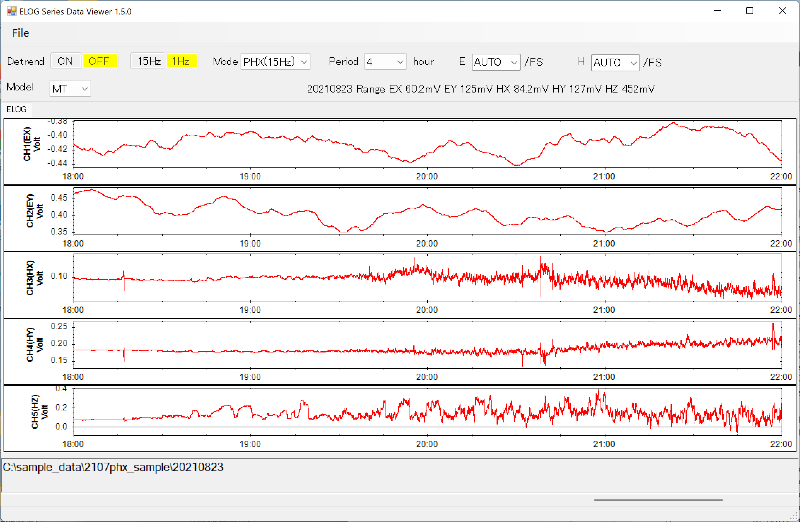

*Figure 1: Main Window*

Detrend ON/OFF button Removes data drift

15Hz/32Hz/120Hz button, 1Hz button Averages data to 1Hz

Pressing the 1 Hz button averages the data to 1 Hz.

Mode PHX(15Hz) mode, ADU(32Hz) mode, AMT(120Hz) mode

Period[hour] Graph X axis range 0.0083, 0.017, 0.1, 0.2, 0.5, 1, 2, 4, 8, 12, 24-hour

Model:

  MT(ELOG-MT 5CH)

  DUAL(ELOG-DUAL/ELOG1K/ELOG1K-DUAL 2CH)

  AMT(ELOG-AMT 4CH)

E[/FS] Graph E range Y axis range 0.1mV, 0.5mV, 1mV, 10mV, 100mV, 200mV, 400mV, 800mV, 1V, 2.5V, 5.0V / FS, AUTO

H[/FS] Graph H range Y axis range 0.1mV, 0.5mV, 1mV, 10mV, 100mV, 200mV, 400mV, 800mV, 1V, 2.5V, 5.0V, 10V, 20V / FS, AUTO

### 4.2. Model setting

By specifying the Model combo box at the top of the window, you can designate the type of data to be loaded. The devices corresponding to each Model are as follows:

- Model MT: ELOG-MT (Rev.B)
- Model DUAL: ELOG-DUAL, ELOG1K-DUAL, ELOG1K
- Model AMT: ELOG-AMT

*Figure 2: Setting Model*

### 4.3. Mode setting

By specifying the Mode combo box at the top of the window, you can set the data mode. The selectable modes vary depending on the Model.

- Model MT: ADU/PHX selection
- Model DUAL: ADU/PHX selection, however, ELOG1K only supports ADU
- Model AMT: Fixed at 120Hz, selection not available

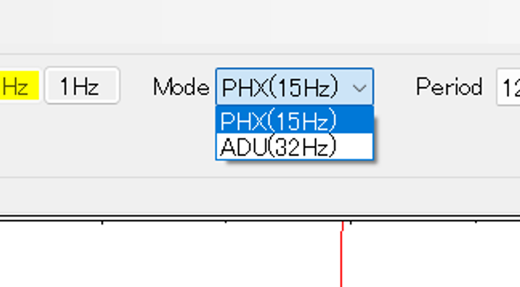

*Figure 3: Setting the mode*

### 4.4. Loading Data

Select "Open" from the "File" menu to open the file selection dialog box, and select and open the ELOG-MT daily data folder (YYYYMMDD). A list of files in the folder will be displayed. If you press the OK button without selecting any files, all 15Hz or 32Hz data files in the folder will be read, and a graph for one day will be drawn.

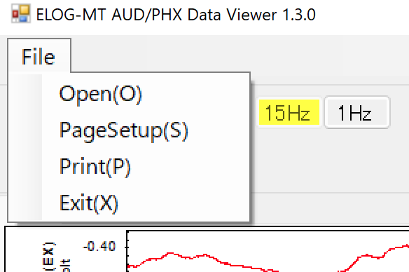

*Figure 4: Loading a file*

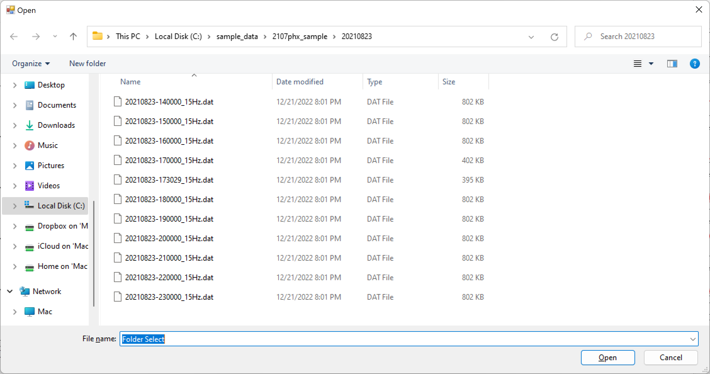

*Figure 5: Folder Selection*

If no data exists in the selected folder, or if the mode setting for the data is incorrect, an error message will be displayed informing the user that no data exists.

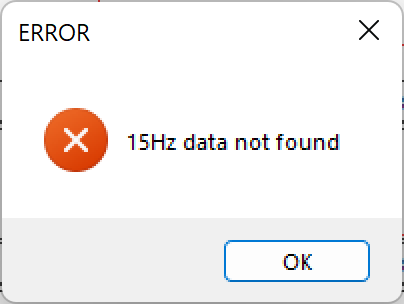

*Figure 6: Error when data does not exist*

When the data has finished loading, a graph of the data read from the file is displayed, with the date portion of the directory of the loaded data file at the top of the window and the full path of the directory in the text box at the bottom.

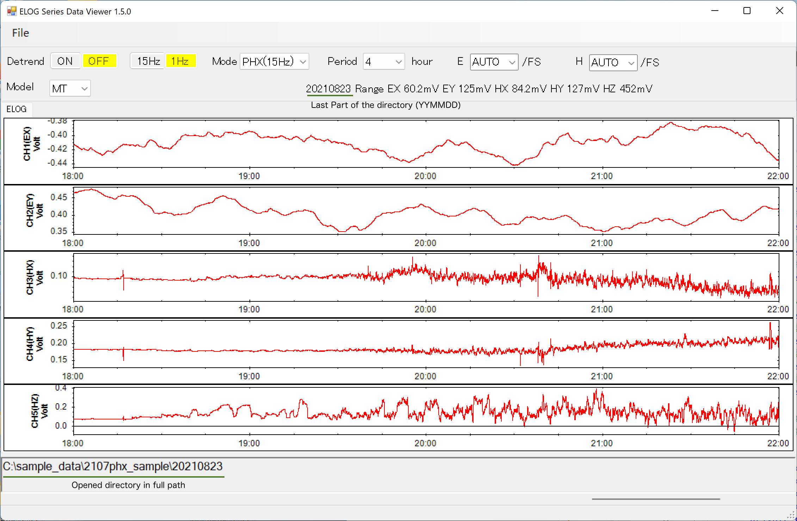

*Figure 7: Displaying Graphs*

### 4.5. Time axis setting

The range of the time axis (horizontal axis) can be set by specifying the Period combo box at the top of the window. The unit is the hour.

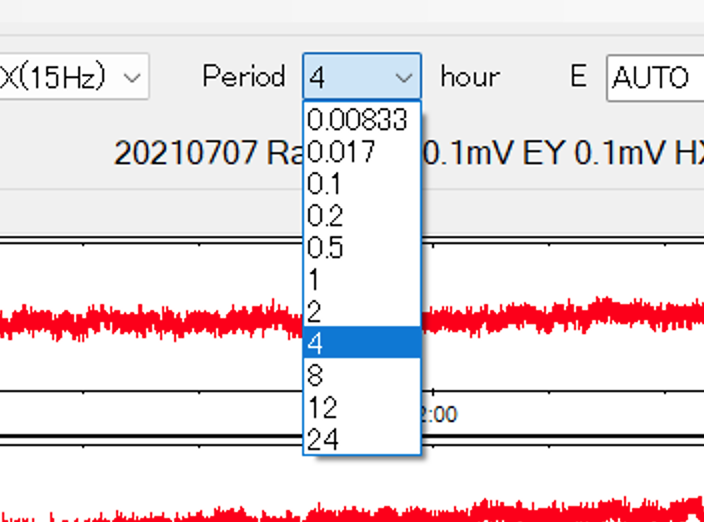

*Figure 8: Setting the time axis*

The scroll bars at the bottom of the window allow you to shift the time range of the graph. You can also press the left arrow key (←) on the keyboard to move the time range of the displayed graph into the past and the right arrow key (→) to move it into the future.

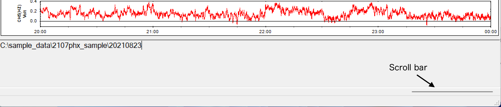

*Figure 9: Adjusting the time axis*

### 4.6. Y axis setting

The E and H combo boxes at the top of the window allow you to adjust the Y-axis range (V/FS or mV/FS) for the E and H ranges, respectively. You can also enter a numerical value of V or mV in this combo box. If only a number is entered, it will be V. mV/V can also be added to the end of the number.

*Figure 10: Y-axis settings*

If AUTO is specified, the automatically set range is displayed in the upper right portion of the window.

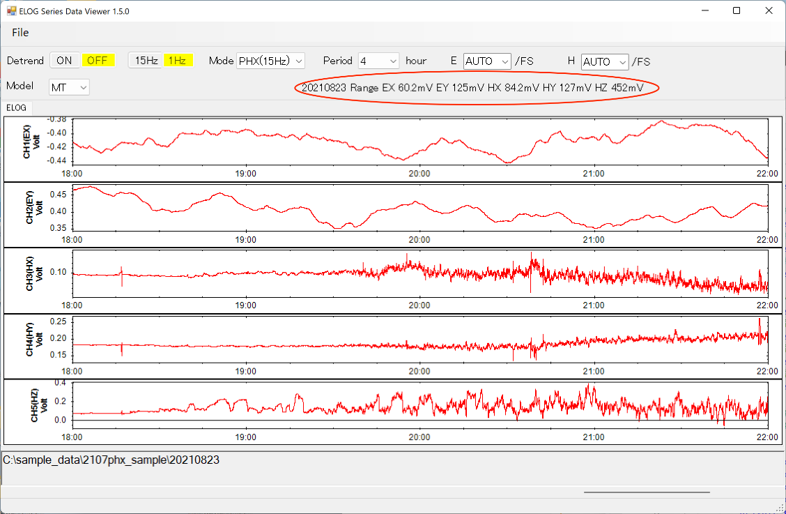

*Figure 11: Range set by AUTO*

### 4.7. Date Change

The date of the displayed graph can be moved to the previous day by pressing the PageDown key on the keyboard and to the next day by pressing the PageUp key.

### 4.8. Data drift elimination

Pressing the Detrend ON button at the top of the window removes drift from the data and plots it. Drift processing is applied to the display only; the data file itself is not altered. The drift component is calculated from the regression line of the displayed range of the data file. The regression line d(t) can be expressed by the following linear equation using time t, slope a, and offset c. However, this program does not remove the offset, only the slope component.

d(t) = at + c

You can turn this feature off with the Detrend OFF button; of the ON/OFF buttons, the current setting is highlighted in yellow.

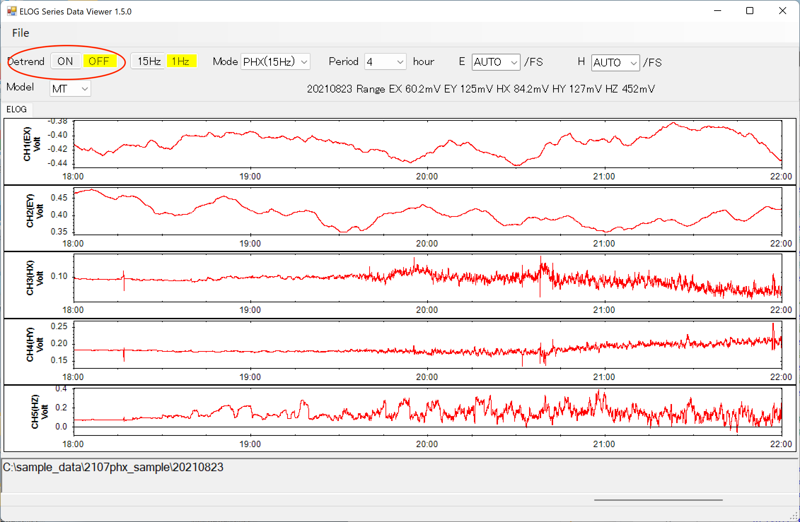

*Figure 12: Drift Removal*

### 4.9. 1Hz averaging of data

The 1Hz button at the top of the window averages and plots 15 pieces of data in PHX mode, 32 pieces of data in ADU mode, or 120 pieces of data in AMT mode. The averaging process is applied to the display only; the data file itself is not changed. 32Hz/15Hz/120Hz buttons can be used to turn this function off; the current setting of the 32Hz/15Hz/120Hz and 1Hz buttons is highlighted in yellow.

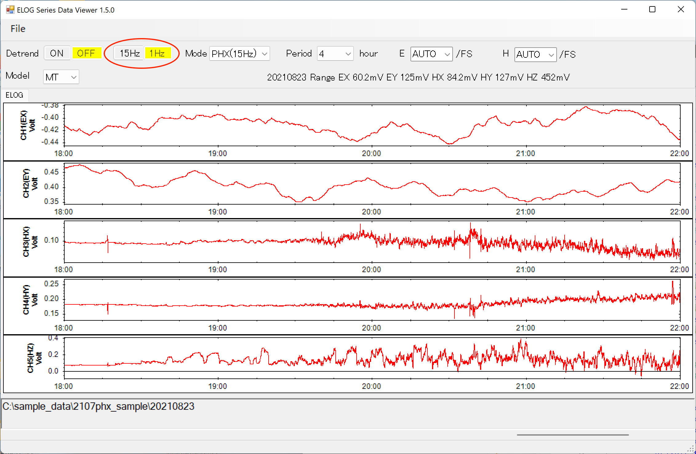

*Figure 13: Averaging*

### 4.10. Printing Graphs

Select "PageSetup" from the "File" menu to set up the paper settings.

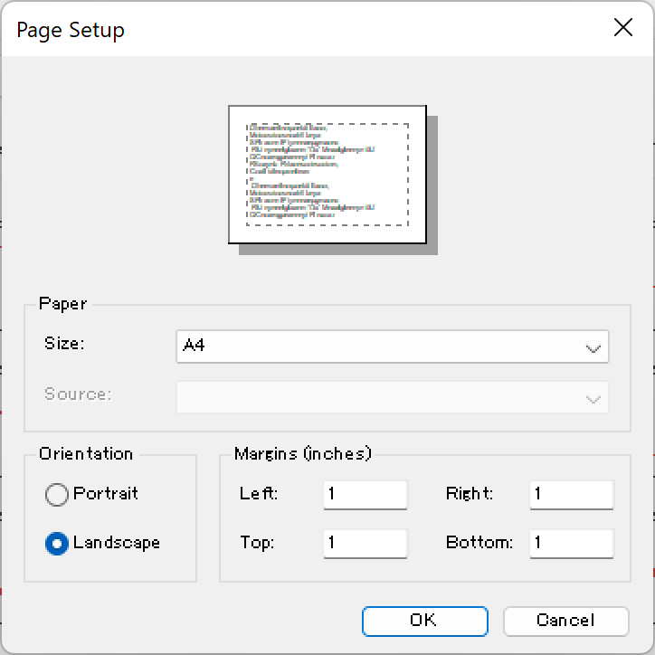

*Figure 14: Page Setup*

Select "Print" from the "File" menu to display the print preview screen. Press the printer icon in the upper left corner to display the printer selection screen. Press "OK" on the printer selection screen to start printing.

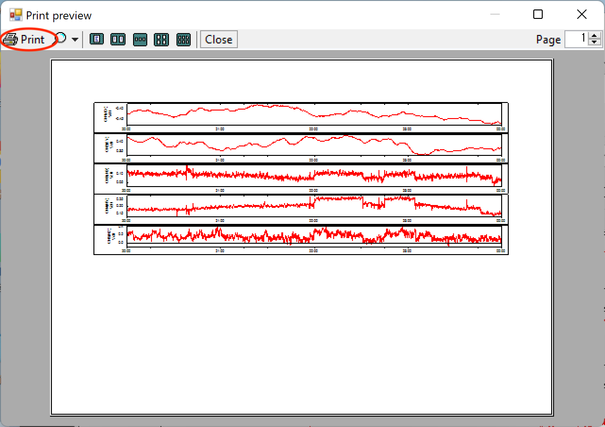

*Figure 15: Print Preview Screen*

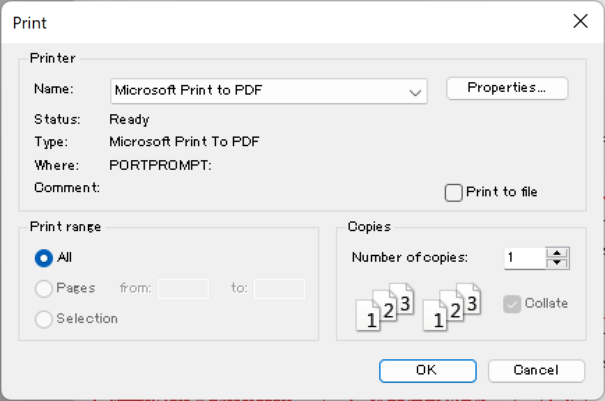

*Figure 16: Printer Selection*

## 5. Change log

### 5.1. Ver1.3.0

- Fixed a bug that prevented the software from starting the next time it was closed by clicking the "X" in the upper right part of the window.
- Added 0.0005 to the Y-axis scale menu.
- Y axis scale E range (EX,EY) and H range (HX,HY,HZ) can be specified independently. Two pull-down list boxes are now available.
- Y-axis scale range can now be specified numerically.
- When Y-axis range is set to AUTO, the current Y-axis range is displayed in the upper right corner of the window.
- E/H Range list display: A part of the list is now mV-unit displayed.
- The folder name (date YYYYMMDD) of the currently displayed data is now displayed on the left side of the Y-axis range display.
- Added time range 0.00833hour (30sec)
- Messages in English in non-Japanese environments.

### 5.2. Ver1.4.0

- Supported 2ch data display of ELOG-DUAL/ELOG1K

### 5.3. Ver1.4.1

- Fixed a bug that the width of the time axis sometimes changes depending on the Y-axis label.

### 5.4. Ver1.5.0

- Supported 120Hz data of ELOG-AMT
- Changed program name from ElogMTGraph to ElogView

### 5.5. Ver1.5.1

- Fixed an issue where graph display was corrupted when reading data from external SSD/USB drives
- Fixed an error that occurred when displaying 24-hour data of ELOG-AMT (120Hz)
- Prevented crash when the settings file is corrupted
- Prevented crash when reading corrupted data files
- Improved data loading and drawing performance
- Added BSD 3-Clause license
