# ELOGシリーズ

(ELOG1K, ELOG-MT, ELOG-DUAL, ELOG1K-DUAL, ELOG-AMT)

15Hz/32Hz/120Hz データグラフ化ソフト

Ver1.5.1

## 取扱説明書

2026/3

NT システムデザイン

R1

---

## 1. はじめに

このソフトは、ELOGシリーズのデータをグラフ化するソフトです。対応データは下記の通りです。

- ELOG-MT(Rev.B含む)(5CH): 15Hzデータ(PHXモード)、32Hzデータ(ADUモード)
- ELOG-DUAL(2CH): 15Hzデータ(PHXモード)、32Hzデータ(ADUモード)
- ELOG1K(2CH): 32Hzデータ(ADUモード)
- ELOG1K-DUAL(2CH): 15Hzデータ(PHXモード)、32Hzデータ(ADUモード)
- ELOG-AMT(4CH): 120Hzデータ

Windowsの.NET Framework 4.7.2上で動作します。1日分のデータ(1時間ファイルが24個)が入っているディレクトリを指定すると1日単位でグラフ化します。全てのチャンネルのグラフを同時に表示します。サンプルレートは15Hz(PHXモード)と32Hz(ADUモード)、および120Hz(ELOG-AMT)のみに対応しています。キーボード操作で翌日や前日に移動することも出来ます。簡易なグラフの印刷機能も有します。

本ソフトウェアはBSD 3-Clauseライセンスのもとで公開されています。ソースコードは以下のGitHubリポジトリから入手できます。

https://github.com/ntsysd/mt-viewer

## 2. 動作環境

.NET Framework 4.7.2が動作しているWindows10以上

## 3. インストールと起動

このプログラムの動作には、.NET Framework 4.7.2以上がインストールされている必要があります。もしインストールされていなければ、以下のURLからダウンロードしてインストールして下さい。

https://dotnet.microsoft.com/download/dotnet-framework/net472

上記ページでDownload .NET Framework 4.7.2 Runtimeを選択する。

### インストール

ElogView1.5.1ディレクトリをインストール先PCのハードディスク上の任意の場所に丸ごとコピーします。

### プログラムの実行

プログラムの実行ファイルはElogView.exeです。

## 4. 操作説明

### 4.1. メインウィンドウ

5チャンネルのグラフが一つのウィンドウに表示されます。

メニューバーの直ぐ下にグラフ表示設定用のボタン、コンボボックスがあります。

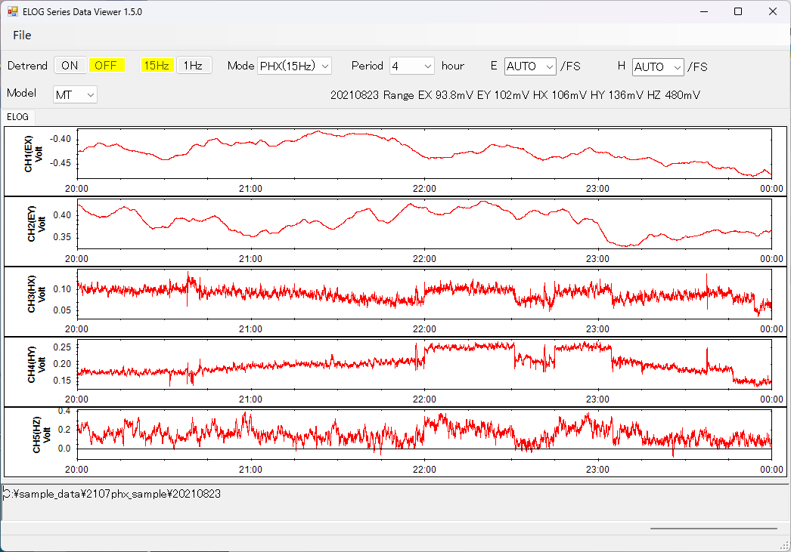

*図1: メインウィンドウ*

Detrend ON/OFFボタン　データのドリフトを除去

15Hz/32Hz/120Hzボタン、1Hzボタン

　1Hzボタンを押すとデータを1Hzに平均化する

Mode　PHX(15Hz)モード、ADU(32Hz)モード、AMT(120Hz)モード

Period[hour]　グラフX軸範囲　0.0083, 0.017, 0.1, 0.2, 0.5, 1, 2, 4, 8, 12, 24hour

Model:

　MT(ELOG-MT 5CH)

　DUAL(ELOG-DUAL/ELOG1K/ELOG1K-DUAL 2CH)

　AMT(ELOG-AMT 4CH)

E[/FS]　グラフ Eレンジ Y軸範囲　0.1mV, 0.5mV, 1mV, 10mV, 100mV, 200mV, 400mV, 800mV, 1V, 2.5V, 5.0V / FS、AUTO

H[/FS]　グラフ Hレンジ Y軸範囲　0.1mV, 0.5mV, 1mV, 10mV, 100mV, 200mV, 400mV, 800mV, 1V, 2.5V, 5.0V, 10V, 20V / FS、AUTO

### 4.2. Modelの設定

ウインドウ上部のModelコンボボックスを指定することで、読み込むデータの種別を指定できます。各Modelに対応する機種は以下の通りです。

- Model MT: ELOG-MT(Rev.B)
- Model DUAL: ELOG-DUAL ELOG1K-DUAL ELOG1K
- Model AMT: ELOG-AMT

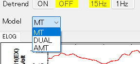

*図2: Modelの設定*

### 4.3. モードの設定

ウィンドウ上部のModeコンボボックスを指定することでデータのモードを設定できます。選択できるModeはModelにより異なります。

- Model MT: ADU/PHX選択
- Model DUAL: ADU/PHX選択 ただしELOG1KはADUのみ対応
- Model AMT: 120Hz固定 選択不可

*図3: モードの設定*

### 4.4. データの読み込み

メニュー"File"から"Open"を選択するとファイル選択ダイアログが表示されます。ELOGの1日分のデータフォルダ(YYYYMMDD)を選択して開きます。フォルダ内のファイル一覧が表示されますが、何もファイルを選択せずにOKボタンを押せば、フォルダ内のデータファイルを全て読み込んで1日分のグラフの描画が行われます。

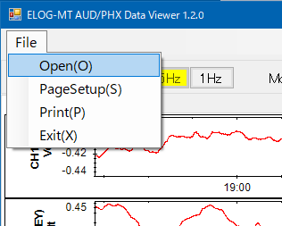

*図4: ファイルの読み込み*

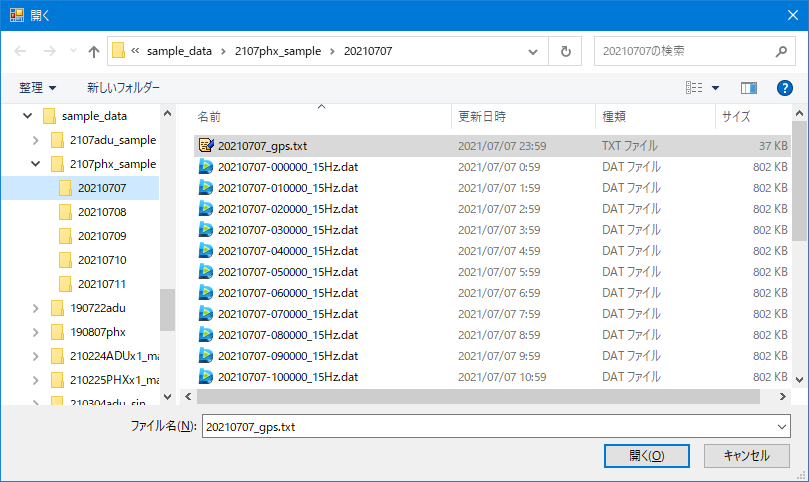

*図5: フォルダの選択*

選択したフォルダにデータが存在しない場合や、データのモードの設定が間違っている場合は、データが存在しないことを知らせるエラーが表示されます。

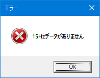

*図6: データが存在しないときのエラー*

データの読み込みが終わると、ファイルから読み取ったデータのグラフが表示され、ウィンドウ上部に読み込んだデータファイルのディレクトリの日付部分、下部のテキストボックスにディレクトリのフルパスが表示されます。

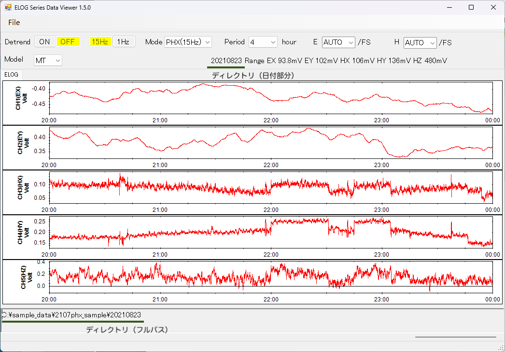

*図7: グラフの表示*

### 4.5. 時間軸の設定

ウィンドウ上部のPeriodコンボボックスを指定することで時間軸(横軸)のレンジを設定できます。単位は時[hour]です。

*図8: 時間軸の設定*

ウィンドウ下にあるスクロールバーを使ってグラフの時間範囲をずらすことが出来ます。またキーボードの左矢印キー(←)を押すことで表示するグラフの時間範囲を過去に、右矢印キー(→)を押すことで未来に移動することが出来ます。

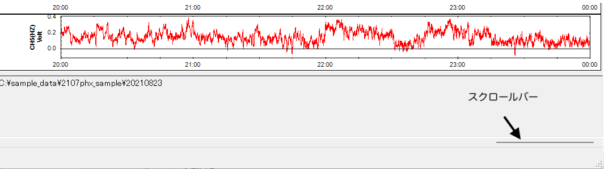

*図9: 時間軸の調整*

### 4.6. Y軸の設定

ウィンドウ上部のEコンボボックスおよびHコンボボックスで、Eレンジ・Hレンジそれぞれの Y軸範囲 (V/FS または mV/FS)を調整できます。AUTOはデータの最大値と最小値が収まるよう自動でレンジが設定されます。また、このコンボボックスには数値でVまたはmV入力もできます。数値のみ入力するとVになります。mV/Vを数値の末尾に加えることもできます。

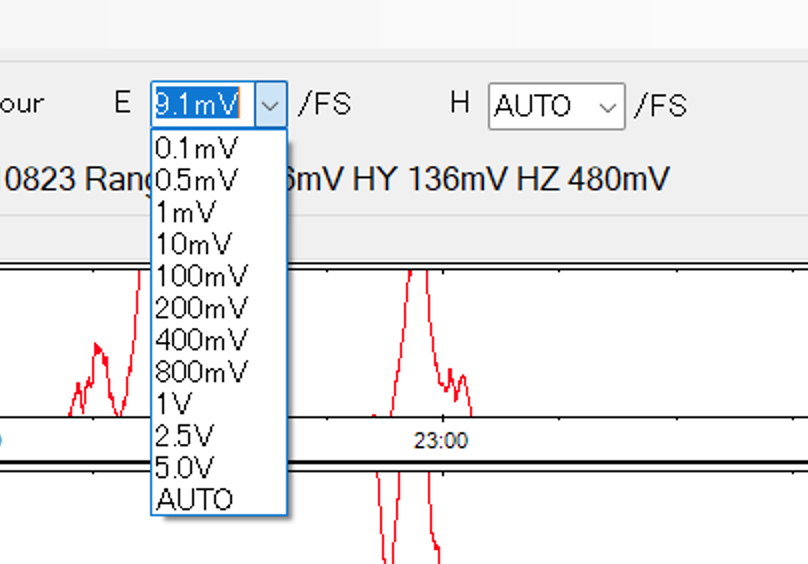

*図10: Y軸の設定*

AUTOを指定した場合、自動で設定されたレンジがウィンドウ右上部分に表示されます。

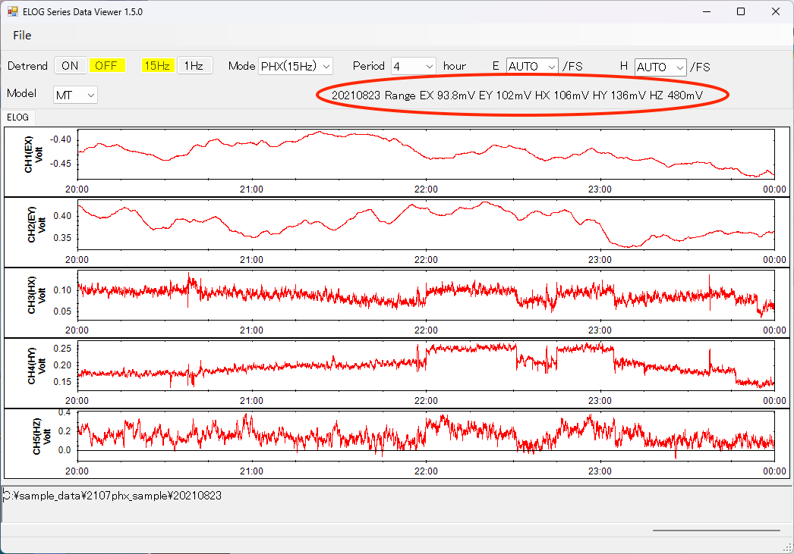

*図11: AUTOで設定されたRange*

### 4.7. 日付の変更

キーボードのPageDownキーを押すことで表示するグラフの日付を前日に、PageUpキーを押すことで翌日に移動することが出来ます。

### 4.8. データのドリフト除去

ウィンドウ上部のDetrend ONボタンを押すと、データのドリフトを除去してプロットします。ドリフト処理は表示のみに適用され、データファイル自体は変更されません。ドリフト成分はデータファイルのうち表示されている範囲の回帰直線から計算しています。回帰直線 d(t)は時間 tと傾き a、オフセット cを使って以下の1次式で表せますが、本プログラムではオフセット分は除去せず、傾き成分のみ除去します。

d(t) = at + c

Detrend OFFボタンでこの機能をオフにできます。ON/OFFボタンのうち、現在の設定が黄色くハイライトされます。

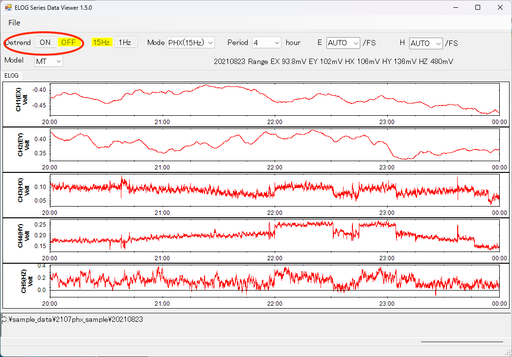

*図12: ドリフト除去*

### 4.9. データの1Hz平均化

ウィンドウ上部の1Hzボタンを押すと、PHXモードでは15個、ADUモードでは32個、AMTモードでは120個のデータを平均化してプロットします。平均化処理は表示のみに適用され、データファイル自体は変更されません。32Hz/15Hz/120Hzボタンでこの機能をオフにできます。32Hz/15Hz/120Hzボタン・1Hzボタンのうち、現在の設定が黄色くハイライトされます。

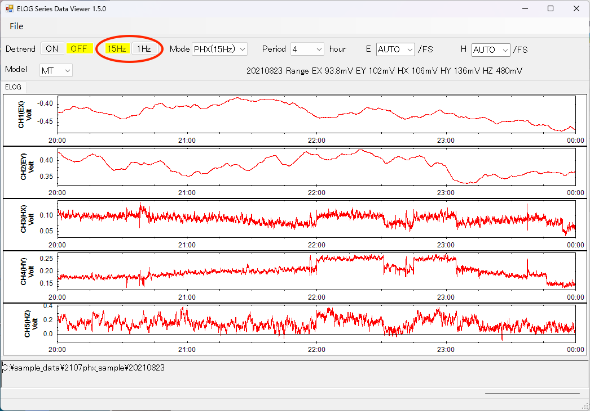

*図13: 平均化*

### 4.10. グラフの印刷

メニューの"File"から"PageSetup"を選択し用紙の設定を行います。

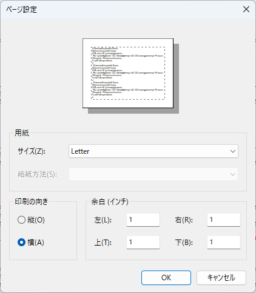

*図14: ページの設定*

メニューの"File"から"Print"を選択すると印刷プレビュー画面が表示されます。左上のプリンターのアイコンを押すとプリンタの選択画面が表示されます。プリンタの選択画面で"OK"を押すと印刷が開始されます。

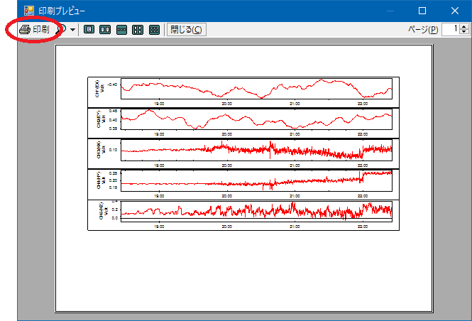

*図15: 印刷プレビュー画面*

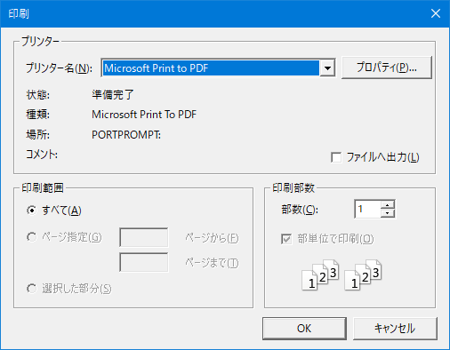

*図16: プリンタの選択*

## 5. 変更履歴

### 5.1. Ver1.3.0

Ver1.3.0のupdate内容

- ウィンドウの右上部分の「×」をクリックして終了すると、次回からソフトが起動できなくなるバグを修正
- Y軸スケールのメニューに0.0005を加えた
- Y軸スケール Eレンジ(EX,EY)とHレンジ(HX,HY,HZ)を独立して指定できるようにした。プルダウンリストボックスが2つになった
- Y軸スケール レンジが数値指定出来るようになった
- Y軸レンジ AUTOの時に、ウィンドウ右上に現在のY軸レンジを表示するようになった
- E/H Rangeリスト表示　一部をmV表示にした
- 現在表示しているデータのフォルダ名(日付 YYYYMMDD)をY軸レンジ表示の左側に表示するようにした
- 時間レンジ追加　0.00833hour (30sec)
- 日本語環境以外ではメッセージを英語にした

### 5.2. Ver1.4.0

Ver1.4.0のUpdate内容

- ELOG-DUAL/ELOG1Kの2chデータ表示に対応した

### 5.3. Ver1.4.1

Ver1.4.1のUpdate内容

- Y軸のラベルによって時間軸の幅が変わることがある問題に対処

### 5.4. Ver1.5.0

Ver1.5.0のUpdate内容

- ELOG-AMTの120Hzデータに対応
- ElogMTGraphからElogViewにプログラム名を変更

### 5.5. Ver1.5.1

Ver1.5.1のUpdate内容

- 外部SSD/USBメモリからのデータ読み込みで描画が崩れる問題を修正
- ELOG-AMT(120Hz)の24時間データ表示で発生するエラーを修正
- 設定ファイルが破損している場合のクラッシュを防止
- 破損したデータファイル読み込み時のクラッシュを防止
- データ読み込みおよび描画のパフォーマンスを改善
- BSD 3-Clauseライセンスを追加
